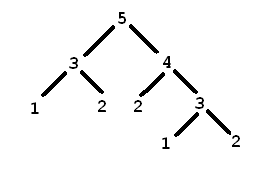

[Problem Links](http://zobayer.blogspot.com/2009/12/cse-102-practice-recursions.html)

Problem 1:

```

You will be given an array of integers, write a recursive solution to print it in reverse order.

Input:
5
69 87 45 21 47
Output:
47 21 45 87 69

```

Problem 2:

```
Write a recursive function to print an array in the following order.
[0] [n-1]
[1] [n-2]
.........
.........
[(n-1)/2] [n/2]

Input:
5
1 5 7 8 9
Output:
1 9
5 8
7 7

```

Problem 3:

```
Write a recursive program to remove all odd integers from an array. You must not use any extra array or print anything in the function. Just read input, call the recursive function, then print the array in main().

Input:
6
1 54 88 6 55 7
Output:
54 88 6

```

Problem 4:

```
Write a recursive solution to print the polynomial series for any input n:
1 + x + x2 + ................. + xn-1

Input:
5
Output:
1 + x + x^2 + x^3 + x^4

```

Problem 5:

```
Write a recursive solution to evaluate the previous polynomial for any given x and n.
Like, when x=2 and n=5, we have 1 + x + x2 + ................. + xn-1 = 31

Input:
2 5
Output:
31

```

Problem 6:

```
Write a recursive program to compute n!

Input:
5
Output:
120

```


Problem 7:

```
Write a recursive program to compute nth fibonacci number. 1st and 2nd fibonacci numbers are 1, 1.

Input:
6
Output:
8

```

Problem 8:

```
Write a recursive program to determine whether a given integer is prime or not.

Input:
49
999983
1
Output:
not prime
prime
not prime

```

Problem 9:
```
Write a recursive function that finds the gcd of two non-negative integers.

Input:
25 8895
Output:
5

```

Problem 10:

```
Write a recursive solution to compute lcm of two integers. You must not use the formula lcm(a,b) = (a x b) / gcd(a,b); find lcm from scratch...

Input:
23 488
Output:
11224

```

Problem 11:

```

Suppose you are given an array of integers in an arbitrary order. Write a recursive solution to find the maximum element from the array.

Input:
5
7 4 9 6 2
Output:
9

```

Problem 12:

```
Write a recursive solution to find the second maximum number from a given set of integers.

Input:
5
5 8 7 9 3
Output:
8

```

Problem 13:

```
Implement linear search recursively, i.e. given an array of integers, find a specific value from it.
Input format: first n, the number of elements. Then n integers. Then, q, number of query, then q integers. Output format: for each of the q integers, print its index (within 0 to n-1) in the array or print 'not found', whichever is appropriate.

Input:
5
2 9 4 7 6
2
5 9
Output:
not found
1


```

Problem 14:
```
Implement binary search recursively, i.e. given an array of sorted integers, find a query integer from it.
Input format: first n, the number of elements. Then n integers. Then, q, number of query, then q integers. Output format: for each of the q integers, print its index (within 0 to n-1) in the array or print 'not found', whichever is appropriate.

Input:
5
1 2 3 4 5
2
3 -5
Output:
2
not found


```


Problem 15:

```
Write a recursive solution to get the reverse of a given integer. Function must return an int

Input:
123405
Output:
504321

```


Problem 16:

```
Read a string from keyboard and print it in reversed order. You must not use any array to store the characters. Write a recursive solutions to solve this problem.

Input:
helloo
Output:
oolleh

```

Problem 17:

```
Write a recursive program that determines whether a given sentence is palindromic or not just considering the alpha-numeric characters ('a'-'z'), ('A'-'Z'), ('0'-'9').

Input:
madam, i'm adam
hulala
Output:
palindromic
not palindromic


```


Problem 18:

```
Implement strcat(), stracpy(), strcmp() and strlen() recursively.

Input:
test on your own
Output:
test on your own

```


Problem 19:



```
If you already solved the problem for finding the nth fibonacci number, then you must have a clear vision on how the program flow works. So now, in this problem, print the values of your fibonacci function in pre-order, in-order and post-order traversal. For example, when n = 5, your program calls 3 and 4 from it, from the call of 3, your program calls 1 and 2 again....... here is the picture:

Input:
5
Output:
Inorder: 1 3 2 5 2 4 1 3 2
Preorder: 5 3 1 2 4 2 3 1 2
Postorder: 1 2 3 2 1 2 3 4 5

```


Problem 20:

```
All of you have seen the tower of Hanoi. You have 3 pillars 'a', 'b' and 'c', and you need transfer all disks from one pillar to another. Conditions are, only one disk at a time is movable, and you can never place a larger disk over a smaller one. Write a recursive solution to print the moves that simulates the task, a -> b means move the topmost of tower a to tower b.

Input:
3
Output:
a -> c
a -> b
c -> b
a -> c
b -> a
b -> c
a -> c


```


Problem 21:

```
You've learn a lot about recursion. It's time to sleep! But before you leave please print the pattern.

Input: 
11

Output:
********************************************
**********..********************..**********
*********....******************....*********
********......****************......********
*******........**************........*******
******..........************..........******
*****............**********............*****
****..............********..............****
***................******................***
**..................****..................**
*....................**....................*
*....................**....................*
**..................****..................**
***................******................***
****..............********..............****
*****............**********............*****
******..........************..........******
*******........**************........*******
********......****************......********
*********....******************....*********
**********..********************..**********
********************************************

```
--------------------

Recursive Tree Traversal : Visual Studio C++ Project1

-Sample output:

```

path : ..\
        ╠═ .
        ╠═ ..
        ╠═ .vs
        ║   ╠═ .
        ║   ╠═ ..
        ║   ╠═ Project1
        ║   ║   ╠═ .
        ║   ║   ╠═ ..
        ║   ║   ╠═ v17
        ║   ║   ║   ╠═ .
        ║   ║   ║   ╠═ ..
        ║   ║   ║   ╠═ .suo
        ║   ║   ║   ╠═ Preview
        ║   ║   ║   ║   ╠═ .
        ║   ║   ║   ║   ╠═ ..
        ║   ║   ║   ║   ╠═ Browse.VC.db
        ║   ║   ║   ║   ╠═ Browse.VC.db-shm
        ║   ║   ║   ║   ╠═ Browse.VC.db-wal
        ║   ║   ║   ║   ╠═ Browse.VC.opendb
        ║   ║   ║   ║   ╠═ ipch
        ║   ║   ║   ║   ║   ╠═ .
        ║   ║   ║   ║   ║   ╠═ ..
        ║   ║   ║   ║   ║   ╠═ AutoPCH
        ║   ║   ║   ║   ║   ║   ╠═ .
        ║   ║   ║   ║   ║   ║   ╠═ ..
        ║   ║   ║   ║   ║   ║   ╠═ 10f5da36ef0ae86b
        ║   ║   ║   ║   ║   ║   ║   ╠═ .
        ║   ║   ║   ║   ║   ║   ║   ╠═ ..
        ║   ║   ║   ║   ║   ║   ╠═ 3638c32bee775b84
        ║   ║   ║   ║   ║   ║   ║   ╠═ .
        ║   ║   ║   ║   ║   ║   ║   ╠═ ..
        ║   ║   ║   ║   ║   ║   ╠═ 46e8d6a38afc1ce5
        ║   ║   ║   ║   ║   ║   ║   ╠═ .
        ║   ║   ║   ║   ║   ║   ║   ╠═ ..
        ║   ║   ║   ║   ║   ║   ║   ╠═ MAIN.ipch
        ║   ║   ║   ║   ║   ║   ╠═ 9293ade62e8e8aca
        ║   ║   ║   ║   ║   ║   ║   ╠═ .
        ║   ║   ║   ║   ║   ║   ║   ╠═ ..
        ║   ║   ║   ║   ║   ║   ║   ╠═ MAIN.ipch
        ║   ║   ║   ║   ║   ║   ╠═ c33920252a9d8408
        ║   ║   ║   ║   ║   ║   ║   ╠═ .
        ║   ║   ║   ║   ║   ║   ║   ╠═ ..
        ║   ║   ║   ║   ║   ║   ╠═ d94d0b0636902840
        ║   ║   ║   ║   ║   ║   ║   ╠═ .
        ║   ║   ║   ║   ║   ║   ║   ╠═ ..
        ║   ║   ║   ║   ║   ║   ║   ╠═ MAIN.ipch
        ╠═ Debug
        ║   ╠═ .
        ║   ╠═ ..
        ║   ╠═ Project1.exe
        ║   ╠═ Project1.pdb
        ╠═ Project1
        ║   ╠═ .
        ║   ╠═ ..
        ║   ╠═ Debug
        ║   ║   ╠═ .
        ║   ║   ╠═ ..
        ║   ║   ╠═ Main.obj
        ║   ║   ╠═ Project1.exe.recipe
        ║   ║   ╠═ Project1.ilk
        ║   ║   ╠═ Project1.log
        ║   ║   ╠═ Project1.tlog
        ║   ║   ║   ╠═ .
        ║   ║   ║   ╠═ ..
        ║   ║   ║   ╠═ CL.command.1.tlog
        ║   ║   ║   ╠═ CL.read.1.tlog
        ║   ║   ║   ╠═ CL.write.1.tlog
        ║   ║   ║   ╠═ link.command.1.tlog
        ║   ║   ║   ╠═ link.read.1.tlog
        ║   ║   ║   ╠═ link.write.1.tlog
        ║   ║   ║   ╠═ Project1.lastbuildstate
        ║   ║   ╠═ vc142.idb
        ║   ║   ╠═ vc142.pdb
        ║   ╠═ dirent.h
        ║   ╠═ Main.cpp
        ║   ╠═ Project1.vcxproj
        ║   ╠═ Project1.vcxproj.filters
        ║   ╠═ Project1.vcxproj.user
        ║   ╠═ x64
        ║   ║   ╠═ .
        ║   ║   ╠═ ..
        ║   ║   ╠═ Debug
        ║   ║   ║   ╠═ .
        ║   ║   ║   ╠═ ..
        ║   ║   ║   ╠═ CodeAnalysisResultManifest.txt
        ║   ║   ║   ╠═ Main.nativecodeanalysis.sarif
        ║   ║   ║   ╠═ Main.nativecodeanalysis.xml
        ║   ║   ║   ╠═ Main.obj
        ║   ║   ║   ╠═ NativeCodeAnalysis.read.1.tlog
        ║   ║   ║   ╠═ Project1.Build.CppClean.log
        ║   ║   ║   ╠═ Project1.ClangTidy
        ║   ║   ║   ║   ╠═ .
        ║   ║   ║   ║   ╠═ ..
        ║   ║   ║   ║   ╠═ compile_commands.json
        ║   ║   ║   ╠═ Project1.ClangTidy.log
        ║   ║   ║   ╠═ Project1.exe.recipe
        ║   ║   ║   ╠═ Project1.ilk
        ║   ║   ║   ╠═ Project1.log
        ║   ║   ║   ╠═ Project1.tlog
        ║   ║   ║   ║   ╠═ .
        ║   ║   ║   ║   ╠═ ..
        ║   ║   ║   ║   ╠═ CL.command.1.tlog
        ║   ║   ║   ║   ╠═ CL.read.1.tlog
        ║   ║   ║   ║   ╠═ CL.write.1.tlog
        ║   ║   ║   ║   ╠═ link.command.1.tlog
        ║   ║   ║   ║   ╠═ link.read.1.tlog
        ║   ║   ║   ║   ╠═ link.write.1.tlog
        ║   ║   ║   ║   ╠═ Project1.lastbuildstate
        ║   ║   ║   ╠═ Project1.vcxproj.FileListAbsolute.txt
        ║   ║   ║   ╠═ vc.nativecodeanalysis.all.xml
        ║   ║   ║   ╠═ vc142.idb
        ║   ║   ║   ╠═ vc142.pdb
        ║   ║   ╠═ Release
        ║   ║   ║   ╠═ .
        ║   ║   ║   ╠═ ..
        ║   ║   ║   ╠═ Main.obj
        ║   ║   ║   ╠═ Project1.exe.recipe
        ║   ║   ║   ╠═ Project1.iobj
        ║   ║   ║   ╠═ Project1.ipdb
        ║   ║   ║   ╠═ Project1.log
        ║   ║   ║   ╠═ Project1.tlog
        ║   ║   ║   ║   ╠═ .
        ║   ║   ║   ║   ╠═ ..
        ║   ║   ║   ║   ╠═ CL.command.1.tlog
        ║   ║   ║   ║   ╠═ CL.read.1.tlog
        ║   ║   ║   ║   ╠═ CL.write.1.tlog
        ║   ║   ║   ║   ╠═ link.command.1.tlog
        ║   ║   ║   ║   ╠═ link.read.1.tlog
        ║   ║   ║   ║   ╠═ link.write.1.tlog
        ║   ║   ║   ║   ╠═ Project1.lastbuildstate
        ║   ║   ║   ╠═ vc142.pdb
        ╠═ Project1.sln
        ╠═ x64
        ║   ╠═ .
        ║   ╠═ ..
        ║   ╠═ Debug
        ║   ║   ╠═ .
        ║   ║   ╠═ ..
        ║   ║   ╠═ Project1.exe
        ║   ║   ╠═ Project1.exe.lastcodeanalysissucceeded
        ║   ║   ╠═ Project1.pdb
        ║   ╠═ Release
        ║   ║   ╠═ .
        ║   ║   ╠═ ..
        ║   ║   ╠═ Project1.exe
        ║   ║   ╠═ Project1.pdb

```

File_Tree : Linux version

```
Enter path: /home/sabit/Downloads/Download_Contents/Interview_Prep_Books
path : /home/sabit/Downloads/Download_Contents/Interview_Prep_Books
        |-- Algorithms-and-Coding-Interviews-master
        |   |-- chapter_decrease_and_conquer.ipynb
        |   |-- chapter_search_strategies.ipynb
        |   |-- Advanced_Search_on_Linear_Data_Structures.ipynb
        |   |-- chapter_python_comparison_sorting.ipynb
        |   |-- search_strategies.pdf
        |   |-- chapter_tree_data_structure_and_traversal.ipynb
        |   |-- Abstract Data Structures.pdf
        |   |-- Python Data Structure.pdf
        |   |-- chapter_combinatorial_search.ipynb
        |   |-- Colab Codes
        |   |   |-- .
        |   |   |-- Colab Notebooks
        |   |   |   |-- chapter_15_bit_manipulation.ipynb
        |   |   |   |-- suffix_array.ipynb
        |   |   |   |-- linear_search_two_pointer.ipynb
        |   |   |   |-- graph_search_application.ipynb
        |   |   |   |-- chapter_8_heap_priority_queue.ipynb
        |   |   |   |-- chapter_6_linear_data_structure.ipynb
        |   |   |   |-- .
        |   |   |   |-- chapter_14_sorting_2.ipynb
        |   |   |   |-- chapter_6_linear_data_structure.depre.ipynb
        |   |   |   |-- chapter_14_sorting.ipynb
        |   |   |   |-- tree_search.ipynb
        |   |   |   |-- ..
        |   |   |   |-- graph_data_structure.ipynb
        |   |   |   |-- tree_data_structure.ipynb
        |   |   |   |-- graph_search.ipynb
        |   |   |-- ..
        |   |-- bit manipulation.pdf
        |   |-- tree_questions.pdf
        |   |-- .
        |   |-- sorting_algorithms_with_python3.pdf
        |   |-- README.md
        |   |-- backtracking.pdf
        |   |-- decrease_and_conquer.pdf
        |   |-- chapter_python_datastrcutures.ipynb
        |   |-- combinatorial_search.pdf
        |   |-- binary_search.pdf
        |   |-- advanced_search_on_linear_data_structures.pdf
        |   |-- chapter_sorting_and_selection_algorithms.ipynb
        |   |-- linear_data_structure.pdf
        |   |-- ..
        |   |-- heap_priority_queue.pdf
        |   |-- two_pointer.pdf
        |-- .
        |-- Coding Ebooks
        |   |-- Algorithms
        |   |   |-- The Algorithm Design Manual by Steven S. Skiena.pdf
        |   |   |-- Introduction to Algorithms - 3rd Edition.pdf
        |   |   |-- Elementary Algorithms.pdf
        |   |   |-- Algorithm Design by Jon Kleinberg, Eva Tardos.pdf
        |   |   |-- Algorithhms 4th Edition by Robert Sedgewick, Kevin Wayne.pdf
        |   |   |-- .
        |   |   |-- Introduction to Algorithms by Udi Manber.pdf
        |   |   |-- Algorithms by Vazirani and Dasgupta.pdf
        |   |   |-- ..
        |   |   |-- Dynamic Programming for Coding Interviews A Bottom-Up Approach to Problem Solving by Meenakshi , Kamal Rawat (z-lib.org).pdf
        |   |-- .
        |   |-- .DS_Store
        |   |-- Interview Prep
        |   |   |-- 1_CTCI_6th_ed.pdf
        |   |   |-- 3_PIE_3rd_ed.pdf
        |   |   |-- Programming Interview Problems Dynamic Programming (with solutions in Python) by Leonardo Rossi (z-lib.org).pdf
        |   |   |-- 2_EoPI.pdf
        |   |   |-- .
        |   |   |-- Daily Coding Problem.pdf
        |   |   |-- ..
        |   |-- Patterns and Design
        |   |   |-- Head_First_Design_Patterns_Elisabeth_Freeman_Eric_Freeman(www.ebook-dl.com).pdf
        |   |   |-- front-end-handbook-2017.pdf
        |   |   |-- AppNee.com.Design.Patterns.Elements.of.Reusable.Object-Oriented.Software.pdf
        |   |   |-- .
        |   |   |-- Patterns of Enterprise Application Architecture - Martin Fowler.pdf
        |   |   |-- Design Patterns, Elements of Reusable Object-Oriented Software.pdf
        |   |   |-- ..
        |   |-- ..
        |   |-- Languages
        |   |   |-- Ruby_]learn-to-program.p4_0.pdf
        |   |   |-- .
        |   |   |-- ProgrammingPearls2nd.pdf
        |   |   |-- ..
        |-- ..


```

----